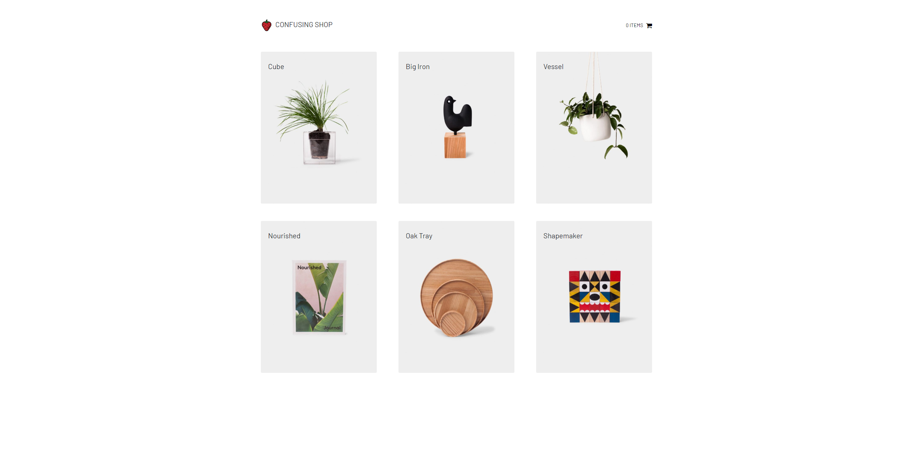

# Confusing Shop

[]()

A shop with seemingly no purpose and yet, it exists

## Technologies

- Bootstrap
- ReactJS
- Javascript
- HTMl5
- CSS3
- SQL

## Live Demo

Try the application here [https://meme.cx/apps/confusing-shop](https://meme.cx/apps/confusing-shop)

## Features

- View assortment of items from the lovely products page.
- View individual items details on its own page.
- Add items to your cart.
- Checkout after providing proper details.

## Preview

[]()

## Development

### Getting Started

1. Clone the repository.

    ```shell
    git clone https://github.com/devin-kormos/wicked-sales-js.git
    ```

1. Navigate to where you cloned it to and you're ready.
